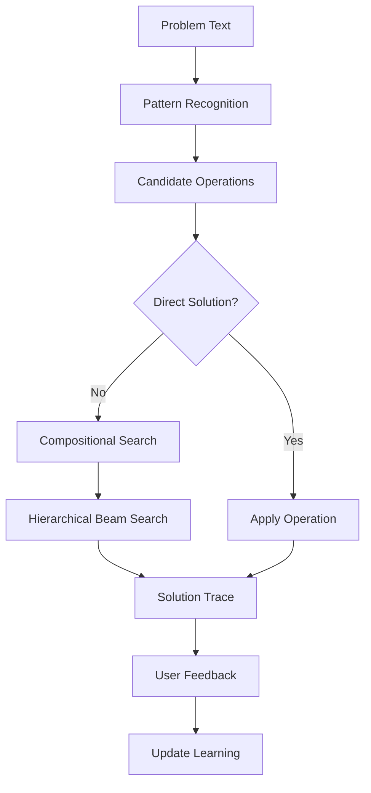

# Compositional Inference Graph (CIG) Architecture

## Technical Specification v1.0

### Executive Summary

The Compositional Inference Graph (CIG) is a novel AI architecture that addresses fundamental limitations of Large Language Models (LLMs) through a hybrid approach combining symbolic reasoning with learned composition patterns. Rather than attempting to understand natural language through massive parameter matrices, CIG operates on well-defined atomic operations that can be composed, learned, and traced explicitly.

---

## 1. Problem Statement

### 1.1 Core LLM Limitations

1. **Black Box Problem**: Reasoning hidden in billions of parameters with no interpretable trace
2. **Hallucination Problem**: Probabilistic generation without factual grounding
3. **Context Window Problem**: Linear scaling with conversation length
4. **Learning Problem**: Requires massive retraining for updates

### 1.2 Design Goals

- **Explainability**: Every answer must provide an auditable reasoning trace
- **Efficiency**: Avoid massive matrix multiplications for inference
- **Continuous Learning**: Learn from each interaction without retraining
- **Compositional Reasoning**: Build complex reasoning from simple, verifiable operations

---

## 2. Core Architecture

### 2.1 Fundamental Concept

Instead of parsing natural language into formal structures (AI-complete problem), CIG:

1. Maintains a library of **atomic operations** with well-defined semantics
2. Uses **pattern recognition** to identify applicable operations
3. Employs **compositional search** to combine operations into solutions
4. Implements **episodic learning** to improve over time

### 2.2 Key Innovation

**Operations as First-Class Citizens**: The system doesn't try to understand language; it recognizes which tools apply and learns successful compositions.

---

## 3. Component Specifications

### 3.1 Atomic Operations

```python
@dataclass
class AtomicOperation:
    """
    Fundamental unit of computation
    """
    name: str                          # Unique identifier
    input_types: List[str]             # Expected input types
    output_type: str                   # Output type produced
    compute: Callable                  # Actual computation
    preconditions: Optional[Callable]  # Validity checks
    embedding: Optional[np.ndarray]    # Learned representation
    success_contexts: List[dict]       # Historical performance
```

**Key Properties:**

- Operations are domain-specific but reusable
- Each operation has clear input/output contracts
- Operations can be composed if types align
- Success contexts enable contextual selection

### 3.2 Pattern Recognition Layer

```python
class MultiModalPatternRecognizer:
    """
    Maps text to applicable operations without parsing
    """
    
    def recognize(text: str, context: dict) -> List[Tuple[str, float]]:
        """
        Returns: [(operation_name, confidence), ...]
        """
```

**Recognition Strategies:**

1. **Keyword Matching** (0.8 confidence): Direct pattern → operation mappings
2. **Semantic Similarity** (0.7 confidence): Embedding-based matching
3. **Learned Patterns** (0.9 confidence): Historical success patterns

**Critical Design Choice:** Multiple recognizers vote rather than single point of failure

### 3.3 Compositional Inference Engine

```python
class CompositionEngine:
    """
    Searches through operation space to find solutions
    """
    
    def solve(problem_state: State, goal: Goal) -> Solution:
        # 1. Identify applicable operations
        # 2. Retrieve similar past compositions
        # 3. Hierarchical beam search
        # 4. Return solution with full trace
```

**Search Strategy:**

- **Hierarchical Planning**: Abstract operations → Concrete sequences
- **Beam Search**: Keep only top-K paths at each depth
- **Guided Search**: Prioritize historically successful compositions

**Complexity Management:**

- Maximum depth: 5-10 operations
- Beam width: 10 paths
- Abstract planning reduces search space by 100-1000x

### 3.4 Experiential Learning System

```python
class ExperientialLearner:
    """
    Learns from experience without rule induction
    """
    
    episodic_memory: List[Episode]       # Full problem traces
    operation_success: Dict[str, List]   # Contextual success rates
    composition_cache: Dict[Pattern, Composition]  # Reusable patterns
```

**Learning Mechanisms:**

1. **Episodic Memory**: Store complete problem-solving traces
2. **Contextual Weights**: Track operation success in different contexts
3. **Composition Patterns**: Cache successful operation sequences
4. **No Rule Induction**: Similarity-based retrieval instead of symbolic rules

### 3.5 Abstraction Hierarchy

```python
class AbstractionHierarchy:
    """
    Auto-discovered operation categories
    """
    
    hierarchy = {
        "transforms": {},    # Type A → Type B
        "aggregators": {},   # List[Type] → Type
        "generators": {},    # Type → List[Type]
        "predicates": {}     # Type → Boolean
    }
```

**Purpose:** Enable coarse-to-fine search without manual ontology definition

---

## 4. System Workflow

### 4.1 Problem Solving Pipeline



### 4.2 Detailed Process

1. **Recognition Phase**
    
    - Extract patterns from input text
    - Identify candidate operations with confidence scores
    - Extract relevant entities (numbers, objects, etc.)
2. **Fast Path (Direct Solution)**
    
    - Try high-confidence operations directly
    - If successful, return immediately with trace
3. **Slow Path (Composition)**
    
    - Initialize beam search with current state
    - For each depth level:
        - Try applicable operations
        - Score resulting states
        - Prune to beam width
    - Return best solution with complete trace
4. **Learning Phase**
    
    - Receive user feedback on correctness
    - Update episodic memory
    - Adjust operation weights
    - Cache successful compositions

---

## 5. Implementation Strategy

### 5.1 Phase 1: Domain-Specific Prototype (Weeks 1-4)

**Goal:** Prove core concepts work

**Domain:** Arithmetic reasoning

**Deliverables:**

- 20-30 atomic operations defined
- Basic pattern recognizer
- Beam search implementation
- Simple episodic memory

**Success Metrics:**

- Solve 80% of basic arithmetic problems
- Show improvement over 100 problems
- Generate interpretable traces

### 5.2 Phase 2: Learning Enhancement (Weeks 5-8)

**Goal:** Demonstrate continuous improvement

**Features:**

- Composition caching
- Contextual operation selection
- Similarity-based retrieval

**Success Metrics:**

- 20% improvement after 500 problems
- Successful transfer between similar problems
- Reduced search depth over time

### 5.3 Phase 3: Multi-Domain (Weeks 9-16)

**Goal:** Prove generalization

**Domains:**

- Logic puzzles
- Simple planning
- Basic algebra

**Success Metrics:**

- Successful domain detection
- Cross-domain transfer learning
- Consistent trace quality

### 5.4 Phase 4: Scale Testing (Months 5-6)

**Goal:** Address real-world complexity

**Features:**

- Distributed operation execution
- Parallel beam search
- Hierarchical abstraction layers

---

## 6. Addressing Key Challenges

### 6.1 The Ontology Bottleneck

**Challenge:** System requires manual definition of atomic operations

**Solution:**

- Start with expert-defined operations
- Use operation composition to create new "virtual" operations
- Eventually: learn new atomic operations from patterns

**Mitigation:**

- Rich initial operation sets (30-50 per domain)
- Operation templates for common patterns
- Community-contributed operation libraries

### 6.2 The Cold Start Problem

**Challenge:** System has no initial experience

**Solutions:**

1. **Synthetic Bootstrap**: Generate simple problems with known solutions
2. **Transfer Learning**: Import compositions from similar domains
3. **Hybrid Approach**: Use small LLM for initial suggestions, refine with CIG

### 6.3 The Router Fragility

**Challenge:** Pattern recognizer is single point of failure

**Solutions:**

1. **Multi-Strategy Recognition**: Keywords + embeddings + learned patterns
2. **Confidence Thresholds**: Only act on high-confidence matches
3. **Fallback Mechanisms**: When confidence low, try multiple operations
4. **Active Learning**: Request clarification when uncertain

### 6.4 Combinatorial Explosion

**Challenge:** Search space grows exponentially

**Solutions:**

1. **Hierarchical Planning**: Reduce search space by 100-1000x
2. **Beam Search**: Linear complexity with beam width
3. **Learned Heuristics**: Prioritize historically successful paths
4. **Early Termination**: Stop when "good enough" solution found

---

## 7. Advantages Over LLMs

### 7.1 Quantifiable Benefits

|Aspect|LLM|CIG|
|---|---|---|
|**Explainability**|Black box|Complete trace|
|**Compute**|O(n²) attention|O(k·d) beam search|
|**Learning**|Full retraining|Local weight updates|
|**Memory**|Context window|Episodic retrieval|
|**Hallucination**|Probabilistic|Grounded operations|
|**Debugging**|Nearly impossible|Trace inspection|

### 7.2 Use Case Alignment

**CIG Excels At:**

- Problems requiring verifiable reasoning
- Domains with clear operations
- Tasks needing continuous learning
- Applications requiring explainability

**LLMs Better For:**

- Creative generation
- Natural language understanding
- Broad, shallow knowledge
- Fuzzy pattern matching

---

## 8. Technical Requirements

### 8.1 Core Dependencies

```python
# Minimal implementation requirements
numpy>=1.20.0          # Numerical operations
scipy>=1.7.0           # Similarity computations
sentence-transformers  # Embedding generation
dataclasses           # Structure definitions
typing                # Type hints
```

### 8.2 Computational Resources

**Minimal Prototype:**

- CPU: Any modern processor
- RAM: 4GB
- Storage: 100MB for operation library + episodic memory

**Production System:**

- CPU: 8+ cores for parallel search
- RAM: 16GB for large episodic memory
- GPU: Optional, for embedding generation

### 8.3 Performance Targets

- **Inference Time**: <1 second for depth-5 search
- **Learning Update**: <100ms per episode
- **Memory Growth**: O(n) with episodes, not exponential
- **Accuracy**: 90%+ on trained domains

---

## 9. Evaluation Framework

### 9.1 Core Metrics

1. **Correctness**: % problems solved correctly
2. **Efficiency**: Average search depth to solution
3. **Learning Curve**: Improvement rate over episodes
4. **Generalization**: Transfer success to new problems
5. **Interpretability**: User rating of trace quality

### 9.2 Benchmark Datasets

1. **Arithmetic**: 1000 problems of increasing complexity
2. **Logic**: Propositional and first-order logic problems
3. **Planning**: Block world and route planning
4. **Algebra**: Simple equation solving

### 9.3 Comparison Baselines

- **Random Search**: Lower bound
- **Exhaustive Search**: Optimal but slow
- **LLM (GPT-4)**: Current state-of-art
- **Classical Planners**: Domain-specific optimal

---

## 10. Future Extensions

### 10.1 Near-term (6-12 months)

1. **Automated Operation Discovery**: Learn new atomic operations from patterns
2. **Multi-Modal Operations**: Include vision, audio operations
3. **Distributed Execution**: Scale across multiple machines
4. **Probabilistic Operations**: Handle uncertainty explicitly

### 10.2 Long-term (1-2 years)

1. **Self-Supervised Learning**: Learn from unlabeled problem solving
2. **Meta-Learning**: Learn how to learn new domains faster
3. **Hybrid LLM Integration**: Use LLMs for NLU, CIG for reasoning
4. **Neuromorphic Hardware**: Map to spike-based processors

---

## 11. Risk Assessment

### 11.1 Technical Risks

|Risk|Probability|Impact|Mitigation|
|---|---|---|---|
|Pattern recognizer too brittle|Medium|High|Multi-strategy approach|
|Search explosion|Low|High|Hierarchical planning|
|Poor generalization|Medium|Medium|Rich operation library|
|Slow learning|Low|Medium|Warm start strategies|

### 11.2 Adoption Risks

- **Learning Curve**: Developers need to think in operations
- **Domain Expertise**: Requires expert knowledge to define operations
- **Integration**: May not fit existing ML pipelines

---

## 12. Conclusion

The Compositional Inference Graph represents a pragmatic alternative to the LLM paradigm. By acknowledging what makes natural language understanding hard (parsing ambiguity, common sense) and explicitly avoiding those problems, CIG focuses on what computers do well: searching, composing, and learning from experience.

This is not a universal intelligence architecture, but rather a powerful reasoning engine for well-defined domains. It trades the flexibility of LLMs for explainability, efficiency, and continuous learning.

The path forward is clear:

1. Build the arithmetic prototype
2. Demonstrate learning and improvement
3. Expand to additional domains
4. Scale to real-world complexity

Success is measurable, risks are manageable, and the potential impact on verifiable AI reasoning is substantial.

---

## Appendix A: Example Problem Trace

```python
Problem: "What is the sum of all factors of 12?"

Recognition:
  - "sum" → sum_list (0.9 confidence)
  - "factors" → factors (0.95 confidence)

Composition Search:
  1. factors(12) → [1, 2, 3, 4, 6, 12]
  2. sum_list([1, 2, 3, 4, 6, 12]) → 28

Solution Trace:
  [
    ("factors", [12], [1, 2, 3, 4, 6, 12]),
    ("sum_list", [[1, 2, 3, 4, 6, 12]], 28)
  ]

Answer: 28
```

---

## Appendix B: Operation Library Sample

```python
CORE_OPERATIONS = {
    # Arithmetic
    "add": AtomicOperation(
        input_types=["number", "number"],
        output_type="number",
        compute=lambda a, b: a + b
    ),
    
    # List operations
    "sum_list": AtomicOperation(
        input_types=["number_list"],
        output_type="number",
        compute=lambda lst: sum(lst)
    ),
    
    # Generators
    "factors": AtomicOperation(
        input_types=["number"],
        output_type="number_list",
        compute=lambda n: [i for i in range(1, n+1) if n % i == 0]
    ),
    
    # Predicates
    "is_prime": AtomicOperation(
        input_types=["number"],
        output_type="boolean",
        compute=lambda n: n > 1 and all(n % i != 0 for i in range(2, int(n**0.5)+1))
    )
}
```

---

## Document Version History

- **v1.0** (Current): Initial formal specification
- Incorporates feedback on text-to-graph challenges
- Addresses combinatorial explosion concerns
- Includes pragmatic implementation path

---

_End of Technical Specification_